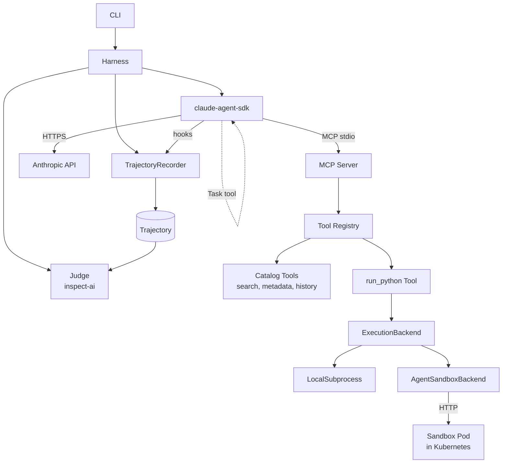

# harness-weaver

A small experimentation harness for agentic systems on recommendation-style
tasks. Built to make the design tradeoffs in agent loops, tool surfaces, and
sandboxed execution **legible** — by varying one knob at a time across
otherwise-identical runs and comparing the resulting trajectories side by side.

> **What this is:** a thin harness around the [Claude Agent SDK][cas] that
> exposes tools via [MCP][mcp], runs untrusted code in a Kubernetes sandbox
> via [`kubernetes-sigs/agent-sandbox`][k8s-as], captures full execution
> trajectories, and runs LLM-as-judge comparisons across **configurations**
> (orchestrator topology, tool surface, memory mode, prompt strategy) on a
> shared task pack.
>
> **What this isn't:** a production system, a recommender, a LangChain
> alternative, or a model benchmark. The model is held constant; what varies
> is everything around it.

[cas]: https://github.com/anthropics/claude-agent-sdk-python
[mcp]: https://modelcontextprotocol.io
[k8s-as]: https://github.com/kubernetes-sigs/agent-sandbox

---

## Why I built this

I wanted a working artifact to think through agent-system design decisions
that don't show up in vibes-based comparisons:

- When does a single-agent ReAct loop beat a multi-agent orchestrator, and on
  what kinds of tasks?
- How much does giving an agent a sandboxed code-execution tool change its
  behavior on analytical queries vs lookup queries?
- What does a clean seam between *tool definition*, *tool transport* (MCP),
  and *tool execution* (sandboxed vs in-process) actually look like in code?
- What's the smallest credible eval pipeline for trajectories — golden sets,
  LLM-as-judge with calibration, automatic failure classification?

The answers turn out to be more interesting in code than in slides.

---

## Quickstart

Requires Python 3.11+. No Kubernetes needed for the default path. An
`ANTHROPIC_API_KEY` is needed to run against a live model; the test
surface and the bundled example trajectories don't require one.

```bash
git clone https://github.com/tomergee/harness-weaver
cd harness-weaver
pip install -e ".[dev]"
make check                                 # 272 tests, ~93% coverage

harness-weaver list-configs                # see the three built-in configurations
```

### Running against the live model

```bash
export ANTHROPIC_API_KEY=sk-ant-...
# Single-agent run with Haiku, the cheapest credible model:
harness-weaver run examples/tasks/discovery-mood-tense.json \
    --config single-agent-basic \
    --model claude-haiku-4-5-20251001

# Multi-agent: orchestrator delegates to Discovery and Explainer workers.
harness-weaver run examples/tasks/discovery-mood-tense.json \
    --config multi-agent-discovery-explainer \
    --model claude-haiku-4-5-20251001

# Sandbox: agent has run_python in addition to catalog tools.
harness-weaver run examples/tasks/analytical-runtime-rating.json \
    --config single-agent-with-sandbox \
    --model claude-haiku-4-5-20251001
```

`run`, `compare`, and `eval` use `RealAgentRunner`, which drives
`claude-agent-sdk`'s `query()` against an in-process MCP server that
wraps our tool registry — see [ADR-0004](docs/adr/0004-mcp-transport-in-process.md)
for the transport choice. The committed trajectories in
[`examples/output/`](examples/output/) are real Haiku runs from the
three configurations above.

### Running without an API key

To exercise the harness end-to-end without a model in the loop, drive
`Harness` directly with a `FakeAgentRunner`:

```python
from harness_weaver.agent_runner import FakeAgentRunner, say, call, answer
from harness_weaver.catalog import Catalog
from harness_weaver.configurations import SINGLE_AGENT_BASIC
from harness_weaver.harness import Harness
from harness_weaver.task import Task

task = Task.from_path("examples/tasks/discovery-mood-tense.json")
runner = FakeAgentRunner([
    call("user_history", {"user_id": "user-001", "limit": 10}),
    call("search_titles", {"genres": ["Thriller"], "max_runtime": 120}),
    answer("I'd recommend Get Out — 104 min, modern thriller, not in your history."),
])
trajectory = Harness(catalog=Catalog.load_default(), runner=runner).run(
    task, SINGLE_AGENT_BASIC,
)
print(trajectory.model_dump_json(indent=2))
```

Tool calls in the script are dispatched to the **real** tool registry, so
this exercises tools, the registry, the catalog, the execution backend
(when `run_python` is in scope), trajectory recording, and configuration
allow-list enforcement — all without an LLM in the loop.

Two committed sample trajectories live in
[`examples/output/`](examples/output/):

* `discovery-mood-tense.single-agent-basic.json` — the example above.
* `analytical-runtime-rating.single-agent-with-sandbox.json` — sandbox
  in action; `run_python` actually executes against the catalog data the
  search tool returned.

For a guided tour of how to use the harness — task format,
configurations, CLI reference, extending the tool surface, common
gotchas — see the **[user manual in `docs/manual/`](docs/manual/README.md)**.

### Running with the Kubernetes sandbox

`run_python` runs through whatever `ExecutionBackend` is wired in.
The default `LocalSubprocessBackend` runs snippets as a child process
on the host (no real isolation). For real isolation —
[`kubernetes-sigs/agent-sandbox`][k8s-as] provisioning a sandbox pod
per Harness — install the controller into your cluster and pass
`--use-k8s`:

```bash
# 1. Install harness-weaver. The Python SDK that talks to the
#    sandbox — `k8s-agent-sandbox` on PyPI — is already pinned in
#    pyproject.toml at >=0.4,<0.5, so this single command gets both.
pip install -e ".[dev]"

# 2. Make sure your cluster is up and `kubectl` is pointed at it.
#    Docker Desktop's Kubernetes is fine; so is Kind, minikube, GKE.
kubectl cluster-info

# 3. Install the agent-sandbox controller (v0.4.5 release artifact)
#    and the bundled `python` SandboxTemplate.
make install-sandbox          # uses the current kubectl context
                              # set NAMESPACE=harness if you don't want 'default'

# 4. Run a task with the K8s backend.
export ANTHROPIC_API_KEY=sk-ant-...
harness-weaver run examples/tasks/analytical-runtime-rating.json \
    --config single-agent-with-sandbox \
    --model claude-haiku-4-5-20251001 \
    --use-k8s
```

The script applies the official release artifact from
[`kubernetes-sigs/agent-sandbox`][k8s-as] —
`https://github.com/kubernetes-sigs/agent-sandbox/releases/download/v0.4.5/manifest.yaml`
— not a snapshot pulled from `main`. Bump `CONTROLLER_VERSION` to a
different tag if you want to track a newer release; keep it
matched to the `k8s-agent-sandbox` floor in `pyproject.toml` to
avoid client/server skew.

If you don't have a cluster yet, `make kind-up` brings one up locally
(Kind + Docker) and runs `install-sandbox` for you. `make kind-down`
tears it back down. See
[`docs/manual/k8s-sandbox.md`](docs/manual/k8s-sandbox.md) for the
full walk-through, troubleshooting, and programmatic use.

### Running with the web UI

For a click-around interface, install the `web` extra and start the
optional FastAPI server:

```bash
pip install -e ".[web]"          # fastapi, uvicorn, jinja2, markdown, bleach
harness-weaver serve --host 127.0.0.1 --port 8000
```

Then open <http://127.0.0.1:8000>. The pages:

| Path                          | What |
|-------------------------------|---|
| `/`                           | Lists trajectories (`*.json`) and reports (`*.md`) under `runs/`. |
| `/runs/new`                   | Form to kick off a single run (task, configuration, model override, K8s sandbox toggle). |
| `/compare/new`                | Same task, two configurations; optional `judge_model` for an LLM verdict. |
| `/eval/new`                   | One configuration over a task pack. |
| `/trajectories/{filename}`    | Renders the trajectory JSON readably — header, final answer, event timeline. |
| `/reports/{filename}`         | Renders compare / eval markdown reports as HTML; surfaces the judge verdict alongside when present. |

Caveats up front: server-rendered Jinja2 templates, single uvicorn
worker, sync execution. The browser blocks for the duration of every
run (~20-90s on Haiku). No auth — bind to `127.0.0.1` and don't
expose it on a network. Markdown is sanitized with `bleach` before
reaching the page (LLM output and trajectory snippets are treated
as untrusted). See
[`docs/manual/web.md`](docs/manual/web.md) for the full walk-through
and the programmatic-use entry point.

---

## Architecture



Five components, three seams:

- **Harness** owns the run lifecycle. Compiles a `Configuration` into SDK
  options, registers hook handlers with the recorder, runs `query()`,
  collects trajectory, hands to judge.
- **MCP server** wraps the tool registry. Tools are Python objects; the MCP
  server is the *transport* that exposes them to the SDK.
- **ExecutionBackend** is the seam where dangerous tools (`run_python`)
  actually execute. `LocalSubprocessBackend` for dev (no K8s); the
  `AgentSandboxBackend` impl wraps `kubernetes-sigs/agent-sandbox` for the
  real demo. Above this seam, tools don't know which backend they have.
- **Recorder** translates SDK hook events into our internal `Trajectory`
  model. The trajectory is the source of truth for eval.
- **Judge** uses `inspect-ai` to run LLM-as-judge over pairs of trajectories,
  calibrated against a small human-rated set. See
  [ADR-0005](docs/adr/0005-judge-design.md) for the rubric and design.

See [`docs/adr/`](docs/adr/) for design decision records.

---

## Configurations

A `Configuration` is the unit of variation. Two configs differ in *exactly
the thing you want to study*; everything else is held constant. Built-in
configurations live in `src/harness_weaver/configurations.py`:

| Configuration | Topology | Tools | Notable |
|---|---|---|---|
| `single-agent-basic` | single | `search_titles`, `get_metadata`, `user_history` | baseline |
| `single-agent-with-sandbox` | single | + `run_python` | adds sandboxed code exec |
| `multi-agent-discovery-explainer` | multi-agent | scoped per worker | orchestrator → Discovery → Explainer |

Each configuration compiles to a `ClaudeAgentOptions` object — different
system prompts, allowed tools, and (for multi-agent) subagent definitions.
The compiler is a one-way function; everything else flows from it.

Add your own in `configurations.py` or via JSON.

---

## Tasks and task packs

Tasks are JSON. A task pack is a list of tasks plus a description. Three
example packs ship with the repo:

- `discovery.json` — open-ended "find me something" prompts that exercise
  the full tool surface.
- `continue-watching.json` — sequel/follow-up prompts that test memory
  handling.
- `analytical.json` — queries that benefit from `run_python` in the
  sandbox (e.g., "find sci-fi titles between 90 and 120 minutes with
  rating > 8 and runtime descending"). Designed to surface the difference
  between configurations with and without code execution.

---

## Eval pipeline

For a single run, the harness produces a JSON trajectory and a markdown
summary. For a comparison run, it additionally invokes the judge, which
produces a verdict (winner / tie / both-fail), reasoning, and a confidence
score.

Failure modes are auto-classified into:

- `hallucinated_tool` — model invented a tool call or argument the schema doesn't allow
- `infinite_loop` — agent repeated the same tool call without progress
- `off_task` — final answer didn't address the user's prompt
- `cost_blowup` — exceeded the configured cost cap
- `refusal` — agent declined to attempt the task
- `other`

The judge prompt and calibration set are in `eval/`.

---

## Design decisions worth calling out

1. **Configuration as the unit of variation, not model.** One provider
   (Anthropic) keeps the comparison apples-to-apples on token semantics
   and tool-use formats. The interesting axes — topology, tool surface,
   memory mode, prompt strategy — vary inside that constraint.

2. **MCP for tool transport, even though the SDK supports in-process
   tools.** The protocol boundary is the right place to feel friction
   in tool design (descriptions, schemas, error shapes). It also makes
   the tool registry portable — any MCP-aware client can use it.

3. **One sandbox per Harness instance, not per task.** Sandboxes have
   non-trivial startup cost; we reset writable state between tasks rather
   than tear down. ADR-003.

4. **Subagents via SDK, not custom orchestration.** Hierarchical
   delegation through the SDK's Task tool is sufficient for the
   topologies we care about. We skip A2A-style peer messaging and
   gain debuggability. ADR-002.

5. **Judge runs over trajectories, not just final answers.** A correct
   answer reached through a hallucinated tool call is a failure mode
   that final-answer eval misses.

---

## Prior art and "why not X"

- **[Hermes Agent][hermes]** is a polished personal-agent runtime — it
  *is* the agent, not a primitives library. Wrapping it would obscure
  the design choices this project is trying to make legible.
- **[LangGraph][lg]** is too opinionated about graph topology for what I
  wanted; the graph metaphor leaks into places it doesn't belong.
- **[OpenAI Agents SDK][oas]** is comparable to Claude Agent SDK in
  shape; I went with Claude Agent SDK because the MCP integration is
  more first-class.
- **[Pydantic AI][pai]** is a sound choice if your differentiator is
  type-strict tool-call parsing. My differentiator is trajectory
  introspection, which is orthogonal.
- **[ADK][adk] / A2A** — Google's ecosystem; not a fit for a project
  built around Anthropic's SDK and the open MCP protocol.

[hermes]: https://github.com/NousResearch/hermes-agent
[lg]: https://github.com/langchain-ai/langgraph
[oas]: https://github.com/openai/openai-agents-python
[pai]: https://github.com/pydantic/pydantic-ai
[adk]: https://github.com/google/adk-python

---

## What's missing on purpose

- **No streaming model output.** Sync only in v1. The eval pipeline benefits
  from streaming; the harness itself doesn't.
- **No telemetry beyond Trajectory.** The trajectory IS the trace. OTel
  integration is a future-work item, not a v1 concern.
- **No retries or backoff.** The SDK handles transient failures; we surface
  what it can't recover from as trajectory events.
- **No real Member-LLM stand-in.** Some configurations could use a smaller
  Claude model as a "smaller in-house" stand-in for cost/quality tradeoffs.
  Not implemented; would be a clean extension.

---

## Engineering hygiene

- `mypy --strict` clean
- `ruff` for lint and format
- `pytest` with coverage gating (≥70%)
- E2E tests replay a recorded SDK message stream from
  `tests/cassettes/` — no live API calls in CI. Re-record with
  `scripts/record-cassette.py` (needs `ANTHROPIC_API_KEY`).
- Pre-commit hooks for formatting and basic checks
- GitHub Actions CI on PRs and pushes to main

Run `make check` to verify everything before opening a PR.

---

## Built with

The harness is glue around a small set of focused libraries. Credit
where it's due:

### Agent runtime and protocol

- **[Claude Agent SDK][cas]** ([`claude-agent-sdk`][casp]) — drives the
  model loop, hierarchical subagents, and the `Task` delegation
  primitive that ADR-0002 is built on. Wrapped by `RealAgentRunner`.
- **[Model Context Protocol][mcp]** (`mcp`) — the wire format the SDK
  uses to call our tools. Our `mcp_server.py` exposes the tool
  registry as an in-process MCP server (see [ADR-0004][adr4]).
- **[Anthropic API][anthropic]** (`anthropic` Python SDK) — the
  underlying provider. Held constant across configurations; what we
  vary is everything around it.

### Sandboxed execution

- **[`kubernetes-sigs/agent-sandbox`][k8s-as]** ([`k8s-agent-sandbox`][kasp])
  — provisions per-Harness sandbox pods on a Kubernetes cluster.
  Wrapped by `AgentSandboxBackend`; lifecycle in [ADR-0003][adr3].
- **[Kind][kind]** + **Docker** — local-cluster bring-up used by
  `make kind-up`. Production-cluster paths (Docker Desktop, GKE, EKS)
  work too via `make install-sandbox`.

### Eval

- **[inspect-ai][inspect-ai]** — drives the LLM-as-judge model call.
  Provider-portable so the judge isn't bolted to the same SDK that
  drives the agents under test (see [ADR-0005][adr5]).

### Validation, CLI, and UX

- **[Pydantic v2][pydantic]** — every public model is a frozen
  pydantic v2 type. Discriminated unions for `Trajectory.events`;
  `model_validator` for cross-field invariants.
- **[Typer][typer]** — the `harness-weaver` CLI.
- **[Rich][rich]** — terminal rendering on the CLI.

### Optional web UI

- **[FastAPI][fastapi]** + **[Uvicorn][uvicorn]** — server for
  `harness-weaver serve` (gated behind the `[web]` extra).
- **[Jinja2][jinja2]** — server-rendered templates. No SPA, no JS
  framework.
- **[Markdown][markdown]** — renders `compare` and `eval` reports as
  HTML.

### Test, lint, type, format

- **[pytest][pytest]** + **pytest-cov**, **pytest-asyncio**,
  **pytest-vcr**.
- **[mypy][mypy]** in `--strict` mode from day one.
- **[Ruff][ruff]** for lint **and** formatting (single tool, fast).
- **[pre-commit][pre-commit]** runs the formatter + a couple of
  basic checks on every commit.
- **[vcrpy][vcrpy]** — listed for completeness; the cassette-backed
  e2e ended up not using it (the SDK runs as a child process, so
  HTTP-boundary VCR can't see the model traffic). We pickle the SDK
  message stream instead.

### CI / repo

- **[GitHub Actions][gha]** — matrix CI on Python 3.11 / 3.12.
- **[Dependabot][dependabot]** — weekly bumps for pip + actions,
  grouped by stack (SDK / eval / sandbox / tooling).
- **[gemini-code-assist][gemini-code-assist]** — automated review
  bot that left the inline comments threaded through every PR in
  this repo.

[casp]: https://pypi.org/project/claude-agent-sdk/
[anthropic]: https://github.com/anthropics/anthropic-sdk-python
[kasp]: https://pypi.org/project/k8s-agent-sandbox/
[kind]: https://kind.sigs.k8s.io/
[inspect-ai]: https://inspect.aisi.org.uk/
[pydantic]: https://docs.pydantic.dev/
[typer]: https://typer.tiangolo.com/
[rich]: https://rich.readthedocs.io/
[fastapi]: https://fastapi.tiangolo.com/
[uvicorn]: https://www.uvicorn.org/
[jinja2]: https://jinja.palletsprojects.com/
[markdown]: https://python-markdown.github.io/
[pytest]: https://docs.pytest.org/
[mypy]: https://mypy-lang.org/
[ruff]: https://docs.astral.sh/ruff/
[pre-commit]: https://pre-commit.com/
[vcrpy]: https://vcrpy.readthedocs.io/
[gha]: https://docs.github.com/en/actions
[dependabot]: https://docs.github.com/en/code-security/dependabot
[gemini-code-assist]: https://github.com/apps/gemini-code-assist
[adr3]: docs/adr/0003-sandbox-lifecycle.md
[adr4]: docs/adr/0004-mcp-transport-in-process.md
[adr5]: docs/adr/0005-judge-design.md

---

## License

MIT.
